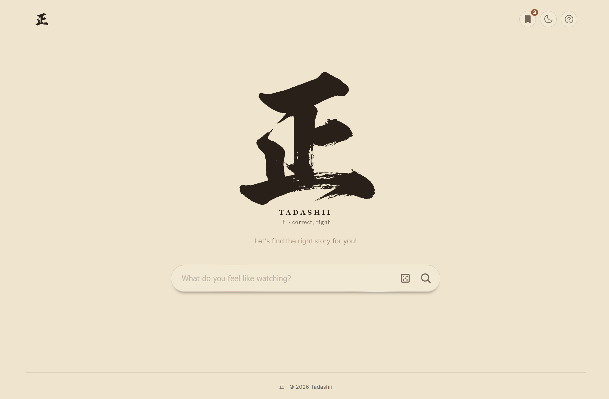
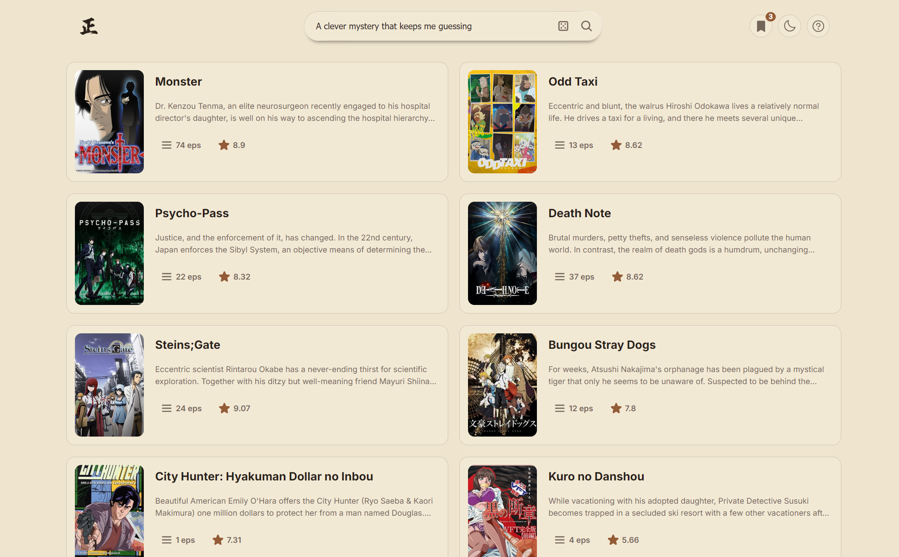
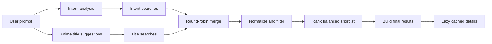

<p align="center">
  
</p>

<h1 align="center">Tadashii</h1>

<p align="center"><em>"I know what I feel like watching, but I don't know what to watch."</em>-me</p>

Tadashii is an AI-assisted anime discovery app. Describe a mood, story, character arc, genre, or an anime you already enjoy, and Tadashii returns a focused set of recommendations with match scores and specific explanations.

Prompts can include positive and negative constraints:

```text
Something like Naruto, but do not recommend Naruto because I have already seen it.
```

## Features

- Natural-language anime search with prompt validation and exclusions
- Concurrent Gemini intent analysis and title suggestions
- Jikan title and intent retrieval with similarity matching and round-robin balancing
- Relevance ranking with franchise diversity and mainline-entry preference
- Up to 10 recommendations by default, controlled from backend configuration
- Expanded anime details with synopsis, trailer, air dates, status, and alternate titles
- Lazy detail loading with in-memory client caching
- Browser-based Watch Later list with watched/unwatched tracking
- Dark, light, and zen themes
- Per-IP recommendation rate limiting and temporary Gemini 503 retry handling
- Pipeline timing logs for backend performance analysis

## Screenshots



## Technology

| Area | Technology |
|---|---|
| Frontend | Vue 3, Vue Router, Vite, GSAP, Phosphor Icons |
| Backend | FastAPI, Pydantic, SlowAPI |
| AI | Google Gemini |
| Anime data | Jikan Edge / MyAnimeList data |
| Persistence | Browser `localStorage` for Watch Later |

## Recommendation Flow



Intent analysis and title suggestions run concurrently. Their Jikan retrieval branches also run concurrently. Search groups are combined in round-robin order so early queries cannot consume the ranking shortlist, and duplicate anime are removed by MAL ID.

Gemini ranks at most 30 cleaned candidates by story, themes, character development, and prompt relevance. It does not rank based on popularity alone. The default final result count is 10.

## Repository Layout

```text
backend/   FastAPI API, recommendation pipeline, tests, and backend docs
frontend/  Vue application, routes, components, and client-side features
```

For API shapes, configuration details, and pipeline internals, see [`backend/README.md`](backend/README.md).

## Local Development

### 1. Backend

From the repository root:

```powershell
cd backend
python -m venv venv
venv\Scripts\Activate.ps1
pip install -r requirements.txt
```

Create `backend/.env` with at least:

```env
GEMINI_API_KEY=your_api_key_here
```

Start FastAPI on the port expected by the Vite proxy:

```powershell
venv\Scripts\python.exe -m uvicorn app.main:app --reload --port 8000
```

Useful URLs:

```text
API docs:     http://127.0.0.1:8000/docs
Health check: http://127.0.0.1:8000/health
```

### 2. Frontend

In another terminal:

```powershell
cd frontend
npm install
npm run dev
```

Open the URL printed by Vite. Development `/api` requests are proxied to `http://localhost:8000`.

For a separately hosted backend, configure:

```env
VITE_API_BASE_URL=https://your-api.example.com
```

## Configuration Highlights

Backend defaults live in `backend/app/config.py` and can be overridden through `backend/.env`.

```env
RECOMMENDATION_COUNT=10
RANKING_CANDIDATE_LIMIT=30
AI_SUGGESTION_MIN_COUNT=5
AI_SUGGESTION_MAX_COUNT=10
INTENT_SEARCH_TERM_LIMIT=8
JIKAN_SEARCH_LIMIT=10
JIKAN_TITLE_SEARCH_SCAN_LIMIT=50
JIKAN_TITLE_MATCH_LIMIT=3
JIKAN_MAX_CONCURRENCY=3
RECOMMENDATION_RATE_LIMIT_REQUESTS=10
RECOMMENDATION_RATE_LIMIT_WINDOW_SECONDS=60
```

`RECOMMENDATION_COUNT` is the single source of truth for the maximum final recommendation count. For production, 10 is the recommended starting value.

## Tests and Builds

Run all backend tests:

```powershell
cd backend
venv\Scripts\python.exe -m unittest discover -s tests -v
```

Build the frontend:

```powershell
cd frontend
npm run build
```

The frontend production URL is configured once in `frontend/site.config.json`. The build uses it to generate canonical metadata, `robots.txt`, and `sitemap.xml`. Update it if the final Vercel URL differs from `https://tadashii.vercel.app`.

The manual end-to-end retrieval test calls Gemini and Jikan and therefore requires a valid API key and network access:

```powershell
backend\venv\Scripts\python.exe backend\tests\test_retrieval_flow.py
```

## Caching and Storage

- Anime details are cached in memory by the frontend for the current page session.
- Watch Later entries are stored in browser `localStorage`; they do not sync between browsers or devices.
- Backend Redis caching and distributed rate limiting are not currently enabled.

## Observability

Recommendation-stage timing is written to the terminal and to:

```text
backend/logs/pipeline_timings.txt
```

Watch the log from the repository root:

```powershell
Get-Content backend\logs\pipeline_timings.txt -Wait
```

## Possible Roadmap

These are product directions being explored, not confirmed release commitments:

- Expand discovery beyond anime to cartoons and live-action series
- Add region-aware streaming availability and service-based discovery for platforms such as Netflix and Prime Video
- Add recommendation feedback such as helpful, irrelevant, and already seen
- Use feedback to refine future rankings and optional preference-based personalization
- Add account-based Watch Later and preference synchronization across devices
- Introduce Redis-backed caching and distributed rate limiting for multi-instance deployment

## Current Limitations

- Recommendation quality depends on Gemini and the available Jikan metadata.
- Jikan Edge search results may omit English and native titles; the expanded dialog retrieves them lazily from the detail endpoint.
- Watch Later is local-only and has no account synchronization.
- Rate-limit storage is in memory and is not shared across multiple backend instances.
