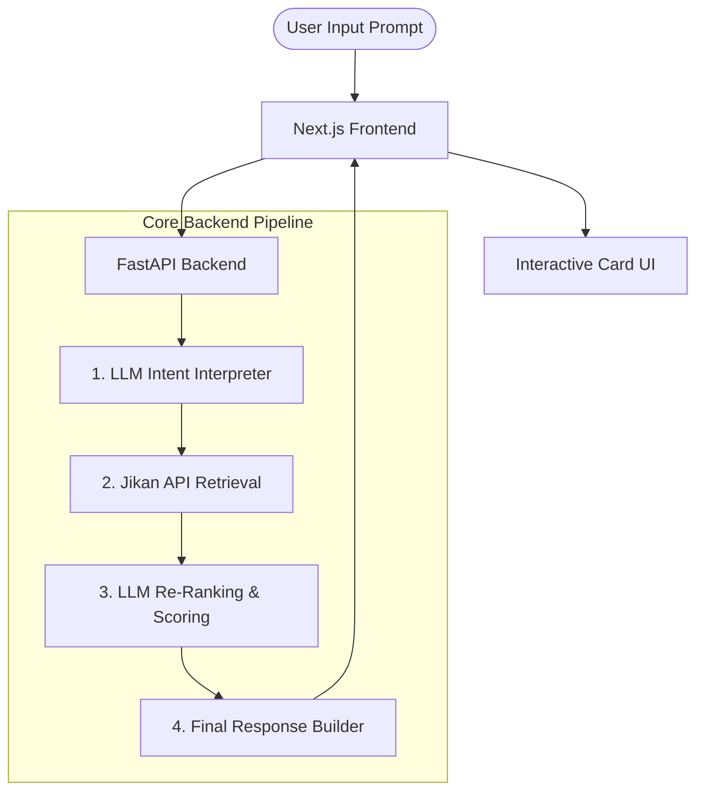

# Tadashii (正しい)

> **“The right story for you.”**  
> *Not “objectively correct,” but emotionally correct — the story that matches your current feeling.*

**Tadashii** is an **emotion-aware AI recommendation engine** for anime (and in the future, movies, series, books, and games). Instead of traditional metadata filtering (genres, tags, ratings), Tadashii allows users to search using emotional prompts and narrative desires (e.g., *"I want an anime where the MC feels worthless but slowly becomes confident despite no one believing in him"*), returning highly aligned suggestions with clear, AI-driven explanations.

---

## Core Value Proposition

| Feature | Traditional Platforms (MAL, AniList) | Tadashii |
| :--- | :--- | :--- |
| **Discovery Model** | Genre filtering, tag sorting, rating-based lists | **Emotion-driven natural language queries** |
| **Relevance** | Searches titles matching literal tags or categories | Finds matches based on **emotional arcs and tone** |
| **Transparency** | Simple list of shows | **AI-powered reasoning explaining the match** |

---

## High-Level System Architecture

The following flow illustrates how a user request traverses the Tadashii system:



---

## Core Intelligence Pipeline

### 1. Intent Understanding (LLM)
*   **Input:** Raw emotional user prompt.
*   **Output:** Extracted structured parameters defining the emotional goals, target narrative arc, tone, and keyword hooks:
    ```json
    {
      "themes": ["self-worth", "growth"],
      "tone": "emotional",
      "arc": "despair → growth",
      "keywords": ["underdog", "perseverance"]
    }
    ```

### 2. Retrieval Layer (Jikan API)
*   **Input:** Structured keywords and parameters.
*   **Action:** Queries the live anime database using the Jikan API.
*   **Output:** Retrieves top 10–30 raw anime candidates.

### 3. AI Re-Ranking Layer
*   **Action:** The LLM evaluates each candidate against the original user prompt for emotional alignment (0-100), narrative match, and tone similarity.
*   **Output:** Specific scoring metrics and contextual explanations:
    ```json
    {
      "match_score": 92,
      "reason": "Strong underdog emotional arc that maps directly to the feeling of slowly overcoming low self-worth."
    }
    ```

### 4. Final Response Builder
*   **Action:** Combines the objective metadata (facts from the API) with the cognitive data (AI re-ranking & explanation).

---

## Hybrid Scoring System

The **Match Score** presented to the user is calculated using a weighted hybrid formula:

$$\text{Match Score} = (0.6 \times \text{Emotional Alignment}) + (0.2 \times \text{Narrative Arc Match}) + (0.1 \times \text{Tone Match}) + (0.1 \times \text{Official Rating})$$

---

## Final Anime Card Structure

Every recommended anime card displays a beautiful combination of data:

### Objective Data (Source: API)
1. **Title & Cover Image**
2. **Synopsis**
3. **Animation Studio**
4. **Official Rating** (MAL / AniList / IMDb)
5. **Number of Episodes & Release Year**
6. **Watch Links**

### AI Layer (Source: Tadashii Intelligence)
7. **Prompt Match Score** (0–100% Visual Indicator)
8. **AI Explanation** (Why this anime matches the user's current emotional prompt)

---

## Backend Directory Blueprint

The backend is organized cleanly to separate routing, data models, third-party services, and core ranking logic:

```text
backend/
├── app/
│   ├── api/                   # API Endpoints
│   │   ├── __init__.py
│   │   └── recommend.py       # Exposes the /recommend route
│   ├── models/                # Pydantic Schemas / Models
│   │   ├── __init__.py
│   │   ├── request_models.py  # Incoming query payloads
│   │   ├── anime_models.py    # Jikan/Anime metadata models
│   │   ├── ai_models.py       # LLM outputs and scoring models
│   │   └── response_models.py # Outbound payload structures
│   ├── services/              # Third-party integration and processing services
│   │   ├── openai_service.py  # LLM connection handler
│   │   ├── jikan_service.py   # Jikan API client wrapper
│   │   └── ranking_service.py # Core re-ranking orchestrator
│   ├── core/                  # Core settings & prompt templates
│   │   ├── prompts.py         # LLM system prompts
│   │   └── config.py          # Environment settings and secrets
│   ├── utils/                 # General utility scripts
│   ├── __init__.py
│   └── main.py                # App entrypoint, middleware (CORS) setup
├── venv/                      # Virtual environment directory (git-ignored)
├── .gitignore                 # Standard file exclusions
└── README.md                  # Comprehensive product overview
```

---

## API Endpoints

### `POST /api/recommend`

*   **Request Payload (`application/json`):**
    ```json
    {
      "prompt": "anime where MC starts weak but becomes strong"
    }
    ```

*   **Response Payload (`application/json`):**
    ```json
    {
      "input": "anime where MC starts weak but becomes strong",
      "results": [
        {
          "title": "Naruto",
          "match_score": 95,
          "reason": "Underdog emotional arc representing massive personal growth and perseverance.",
          "episodes": 220,
          "year": 2002,
          "image": "https://cdn.myanimelist.net/images/anime/13/11460.jpg"
        }
      ]
    }
    ```

---

## Installation & Quickstart

### 1. Set Up Virtual Environment
```bash
python -m venv venv
```
Activate the environment:
*   **Windows (PowerShell):** `.\venv\Scripts\Activate.ps1`
*   **Windows (CMD):** `.\venv\Scripts\activate.bat`
*   **macOS / Linux:** `source venv/bin/activate`

### 2. Install Dependencies
```bash
pip install fastapi uvicorn pydantic
```

### 3. Run Development Server
```bash
uvicorn app.main:app --reload
```
*   **Swagger API Docs:** [http://127.0.0.1:8000/docs](http://127.0.0.1:8000/docs)
*   **ReDoc Docs:** [http://127.0.0.1:8000/redoc](http://127.0.0.1:8000/redoc)

---

## Key Design Principles

1.  **No RAG (for now):** We don't host vector databases or embedding pipelines. The Jikan API is the retrieval layer; the LLM is purely the reasoning/ranking layer.
2.  **AI is NOT the database:** The LLM's only role is to interpret user intent, rank candidates, and generate personalized explanations.
3.  **Truth comes from the API:** Ratings, episode counts, studios, and images are strictly loaded from official sources to completely eliminate hallucinations.
4.  **Explicitly Out of Scope (for now):** No vector DBs, no custom embeddings pipeline, no user personalization history, and no heavy ML infrastructure.

---

## Future Expansion

While starting with **anime**, the underlying engine is highly generic. Since the core system operates on **emotional resonance matching**, the retrieval layer can easily swap to source data from other providers to recommend:
*   Movies & TV Shows
*   Books & Light Novels
*   Video Games
