# Tadashii

Tadashii is an emotion-aware anime recommendation app. The backend takes natural-language prompts such as "I want an emotional anime about a lonely underdog who gets stronger" and returns anime recommendations with AI-generated match explanations.

## Current Backend Pipeline

The backend is built as a simple six-stage pipeline:

```mermaid
graph LR
    %% Styles
    classDef io fill:#000000,stroke:#2ecc71,stroke-width:2px,color:#ffffff;
    classDef io_out fill:#000000,stroke:#e74c3c,stroke-width:2px,color:#ffffff;
    classDef process fill:#1a1c23,stroke:#ffffff,stroke-width:1px,color:#ffffff;

    %% Nodes
    user_query((user query)):::io
    final_output((final output)):::io_out

    subgraph pipeline [ Pipeline ]
        direction LR
        intent_parser[Intent Parser]:::process
        retrieval[Retrieval]:::process
        normalize[Normalize to Tadashii Shape]:::process
        filter[Filter Clean Candidates]:::process
        rank[Rank Clean Candidates]:::process
        build_response[Build Final Response]:::process
    end

    %% Connections
    user_query --> intent_parser
    intent_parser --> retrieval
    retrieval --> normalize
    normalize --> filter
    filter --> rank
    rank --> build_response
    build_response --> final_output

    %% Subgraph Styling
    style pipeline fill:none,stroke:#f39c12,stroke-width:2px;
```



The important design choice is that raw Jikan API data is normalized into an internal `AnimeCandidate` model before filtering or ranking. The AI ranker receives cleaned candidates, not raw API blobs.

## Repository Layout

```text
backend/   FastAPI recommendation API
frontend/  Frontend application
```

See the backend documentation for the current API, pipeline details, configuration, and run commands:

```text
backend/README.md
```

## Backend Quickstart

From inside the `backend` folder:

```powershell
venv\Scripts\python.exe -m uvicorn app.main:app --reload --port 8002
```

Open the API docs:

```text
http://127.0.0.1:8002/docs
```

