# Tadashii Backend

Tadashii is an emotion-aware anime recommendation backend built with FastAPI. It accepts a natural-language prompt, retrieves possible anime from Jikan, cleans the data into an internal model, filters noisy results, asks Gemini to rank the candidates, and returns frontend-friendly recommendation results.

The current backend is intentionally simple: it is a pipeline of small services where each stage has one job.

## Current Pipeline

The backend currently uses a six-step recommendation pipeline:

1. Intent parsing
2. Candidate retrieval
3. Normalization
4. Filtering
5. AI ranking
6. Response building

```mermaid
graph LR
    %% Styles
    classDef io fill:#000000,stroke:#2ecc71,stroke-width:2px,color:#ffffff;
    classDef io_out fill:#000000,stroke:#e74c3c,stroke-width:2px,color:#ffffff;
    classDef process fill:#1a1c23,stroke:#ffffff,stroke-width:1px,color:#ffffff;

    %% Nodes
    user_query((user query)):::io
    final_output((final output)):::io_out

    subgraph pipeline [ Pipeline ]
        direction LR
        intent_parser[Intent Parser]:::process
        retrieval[Retrieval]:::process
        normalize[Normalize to Tadashii Shape]:::process
        filter[Filter Clean Candidates]:::process
        rank[Rank Clean Candidates]:::process
        build_response[Build Final Response]:::process
    end

    %% Connections
    user_query --> intent_parser
    intent_parser --> retrieval
    retrieval --> normalize
    normalize --> filter
    filter --> rank
    rank --> build_response
    build_response --> final_output

    %% Subgraph Styling
    style pipeline fill:none,stroke:#f39c12,stroke-width:2px;
```



## Pipeline Stages

### 1. Intent Parsing

File: `app/services/intent/ai_intent_service.py`

The intent parser sends the user prompt to Gemini and asks for structured search intent.

Expected intent shape:

```json
{
  "is_valid_prompt": true,
  "validation_reason": "",
  "search_keywords": [],
  "semantic_tags": [],
  "themes": [],
  "mood": "",
  "genres": [],
  "character_arc": ""
}
```

This stage also validates that the prompt is understandable and relevant to anime discovery. Invalid prompts stop before Jikan with HTTP 422. Intent parsing and AI title suggestions run concurrently from the same user prompt.

### 2. Candidate Retrieval

Files:

```text
app/services/retreival/ai_suggest.py
app/services/retreival/jikan_service.py
app/services/retreival/merge_service.py
```

Retrieval gathers possible anime. It does not decide which anime is best.

Current retrieval paths:

```text
AI suggested titles -> Jikan title search
Parsed intent terms -> Jikan keyword search
```

Results take turns across individual search-query groups and then across the
title and intent branches. This round-robin ordering prevents early queries
from filling the ranking shortlist. Results are deduplicated by `mal_id`.

Title retrieval and intent retrieval run concurrently. Each branch may use up
to `JIKAN_MAX_CONCURRENCY` searches, so the default peak across both branches
is six active Jikan requests.

### 3. Normalization

File: `app/services/normalization/normalize_service.py`

Normalization converts raw Jikan dictionaries into Tadashii's internal `AnimeCandidate` model.

Raw Jikan data is large and nested. The normalizer extracts only the useful fields and cleans nested structures.

Examples:

```text
Jikan genres objects -> list[str]
Jikan studios objects -> list[str]
Jikan images.jpg.large_image_url -> image
Jikan trailer.url -> trailer_url
```

Internal candidate shape:

```python
class AnimeCandidate(BaseModel):
    mal_id: int
    title: str
    type: str | None = None
    synopsis: str | None = None
    genres: list[str] = []
    themes: list[str] = []
    demographics: list[str] = []
    score: float | None = None
    episodes: int | None = None
    year: int | None = None
    image: str | None = None
    url: str | None = None
    data_source: str = "jikan"
```

### 4. Filtering

File: `app/services/filter/filter_service.py`

Filtering removes obvious junk before the AI ranker sees candidates.

Current filters remove:

```text
Music entries
Rx - Hentai entries
Hentai genre entries
Very short Special, OVA, or ONA entries
Entries with no synopsis
```

This keeps ranking cheaper, cleaner, and easier to debug.

### 5. AI Ranking

File: `app/services/ranking/ranking_service.py`

Ranking sends only cleaned candidates to Gemini. It does not receive raw Jikan blobs.

The ranker returns lightweight judgment objects:

```json
[
  {
    "mal_id": 20,
    "title": "Naruto",
    "prompt_match": 95,
    "reason": "Strong lonely underdog growth story.",
    "emotion_tags": ["lonely", "underdog", "growth"]
  }
]
```

The ranking service uses `build_rank_payload()` to convert Pydantic `AnimeCandidate` objects into plain dictionaries before sending them to Gemini.

Ranking is capped by `RANKING_CANDIDATE_LIMIT` and applies relevance-quality,
franchise-diversity, and mainline-entry rules. A spin-off should not beat a
strongly relevant canonical entry because of a superficial keyword match.

### 6. Response Building

File: `app/services/response/response_builder_service.py`

The response builder combines:

```text
AI ranking output
+ normalized AnimeCandidate objects
= RecommendationResult objects
```

Final result model:

```python
class RecommendationResult(BaseModel):
    anime: AnimeCandidate
    match_score: int
    reason: str
    emotion_tags: list[str] = []
```

The response builder matches ranking data back to candidates using `mal_id`. If the AI returns an unknown `mal_id`, that ranking item is skipped.

## API

### POST `/api/recommend`

Request:

```json
{
  "prompt": "I want an emotional anime about a lonely underdog who gets stronger and finds real friends."
}
```

### GET `/api/anime/{mal_id}/details`

Returns metadata loaded lazily by the expanded frontend dialog:

```json
{
  "mal_id": 16498,
  "title": "Shingeki no Kyojin",
  "title_english": "Attack on Titan",
  "title_japanese": "進撃の巨人",
  "image_url": "https://cdn.example/attack-on-titan-large.jpg",
  "studios": ["Wit Studio"],
  "synopsis": "...",
  "trailer_url": "https://...",
  "year": 2013,
  "status": "Finished Airing",
  "aired_from": "2013-04-07",
  "aired_to": "2013-09-29"
}
```

Response shape:

```json
{
  "input": "I want an emotional anime about a lonely underdog who gets stronger and finds real friends.",
  "intent": {
    "search_keywords": ["underdog", "growth", "friendship"],
    "semantic_tags": ["zero to hero"],
    "themes": ["loneliness", "belonging"],
    "mood": "emotional",
    "genres": ["Drama", "Shounen"],
    "character_arc": "lonely outcast grows stronger"
  },
  "results": [
    {
      "anime": {
        "mal_id": 20,
        "title": "Naruto",
        "type": "TV",
        "synopsis": "...",
        "genres": ["Action", "Adventure", "Fantasy"],
        "themes": [],
        "score": 7.99,
        "episodes": 220,
        "year": 2002,
        "image": "https://...",
        "url": "https://myanimelist.net/anime/20/Naruto",
        "data_source": "jikan"
      },
      "match_score": 95,
      "reason": "Strong lonely underdog growth story.",
      "emotion_tags": ["lonely", "underdog", "growth"]
    }
  ]
}
```

## Project Structure

```text
backend/
  app/
    api/
      recommend.py
    models/
      schema.py
    services/
      filter/
        filter_service.py
      intent/
        ai_intent_service.py
      normalization/
        normalize_service.py
      ranking/
        ranking_service.py
      response/
        response_builder_service.py
      retreival/
        ai_suggest.py
        jikan_service.py
        merge_service.py
        retrieval.py
    config.py
    main.py
  tests/
    test_retrieval_flow.py
  .env
  README.md
```

Note: the folder name is currently `retreival`. It works as-is, but it is misspelled. Rename it carefully later only if you also update all imports.

## Configuration

Configuration lives in `app/config.py` and reads from `.env`.

Required or supported environment variables:

```env
GEMINI_API_KEY=your_api_key_here
GEMINI_MODEL=gemini-3.1-flash-lite
GEMINI_TIMEOUT_MS=30000
GEMINI_RANKING_RETRY_DELAY_SECONDS=0.5
GEMINI_RANKING_MAX_ATTEMPTS=2
RECOMMENDATION_COUNT=10
RANKING_CANDIDATE_LIMIT=30
AI_SUGGESTION_MIN_COUNT=5
AI_SUGGESTION_MAX_COUNT=10
INTENT_KEYWORD_LIMIT=5
INTENT_SEARCH_TERM_LIMIT=8
SEARCH_QUERY_MAX_LENGTH=80
RECOMMENDATION_RATE_LIMIT_REQUESTS=10
RECOMMENDATION_RATE_LIMIT_WINDOW_SECONDS=60
JIKAN_BASE_URL=https://jikan-edge.lucas-hdo.workers.dev/v1
JIKAN_SEARCH_LIMIT=10
JIKAN_TITLE_SEARCH_SCAN_LIMIT=50
JIKAN_TITLE_MATCH_LIMIT=3
JIKAN_MAX_CONCURRENCY=3
JIKAN_TIMEOUT_SECONDS=10
JIKAN_RETRY_COUNT=2
ANIMECHAN_BASE_URL=https://api.animechan.io/v1
ANIMECHAN_TIMEOUT_SECONDS=8
```

The defaults and explicit-content exclusions live together in `app/config.py`.
`RECOMMENDATION_COUNT` is the final result count. `RANKING_CANDIDATE_LIMIT`
is the maximum candidate payload sent to ranking and is automatically raised
to at least the final result count. The AI suggestion and intent settings
control how many search terms enter retrieval; `JIKAN_SEARCH_LIMIT` controls
how many candidates each individual Jikan search retains.

Explicit-content and short-extra filtering is configured by
`BLOCKED_ANIME_TYPES`, `BLOCKED_ANIME_RATINGS`, `BLOCKED_ANIME_GENRES`,
`SHORT_FORM_TYPES`, and `SHORT_FORM_MAX_EPISODES` in `app/config.py`.

SlowAPI applies the in-memory IP rate limit only to `POST /api/recommend` and
returns HTTP 429 when exceeded. Its underlying `limits` storage is per backend
process; configure a Redis storage URI later when running multiple workers or
instances. Configure trusted proxy handling at the ASGI server or hosting layer
before relying on forwarded client IP headers.

`JIKAN_SEARCH_LIMIT` controls how many jikan-edge results are retained from an
intent query. Suggested-title searches inspect up to
`JIKAN_TITLE_SEARCH_SCAN_LIMIT` results and retain the closest
`JIKAN_TITLE_MATCH_LIMIT` title matches. The retrieval service adapts
jikan-edge's camelCase results to the internal Jikan-v4-shaped dictionaries
expected by the rest of the pipeline.

`JIKAN_MAX_CONCURRENCY` limits how many independent Jikan searches run at once
within title retrieval and intent retrieval. Finished search groups are placed
in stable round-robin order, independent of request completion order.

`GEMINI_TIMEOUT_MS` bounds each Gemini request. Broad SDK retries are disabled
so an upstream stall cannot hold the recommendation pipeline indefinitely. The
ranking stage makes one additional attempt only for a temporary Gemini HTTP
503, after `GEMINI_RANKING_RETRY_DELAY_SECONDS`.

## Running The Server

From inside the `backend` folder:

```powershell
venv\Scripts\python.exe -m uvicorn app.main:app --reload --port 8000
```

API docs:

```text
http://127.0.0.1:8000/docs
```

Health check:

```text
http://127.0.0.1:8000/health
```

## Pipeline Timing Logs

Every `POST /api/recommend` request receives a short request ID. The backend logs the duration and output count of each recommendation stage to the terminal and to:

```text
logs/pipeline_timings.txt
```

The timing file rotates at 5 MB and retains up to five backups. Runtime logs are excluded from Git.

Watch the timing log from the repository root with:

```powershell
Get-Content backend\logs\pipeline_timings.txt -Wait
```

Example:

```text
request=rec-a81f93c2 stage=title_retrieval duration_s=4.821 status=ok count=47
request=rec-a81f93c2 stage=filter duration_s=0.001 status=ok before=54 after=31
request=rec-a81f93c2 stage=total duration_s=15.431 status=ok results=10
```

## Manual Smoke Test

A manual end-to-end retrieval smoke test lives here:

```text
tests/test_retrieval_flow.py
```

Run it from the project root:

```powershell
backend\venv\Scripts\python.exe backend\tests\test_retrieval_flow.py
```

This test calls Gemini and Jikan, so it requires network access and a valid `GEMINI_API_KEY`.

## Design Rules

The backend follows these rules:

```text
The LLM should not rank raw Jikan data.
Jikan service should only talk to Jikan.
Intent service should only parse intent.
Normalization should create AnimeCandidate objects.
Filtering should remove obvious junk before ranking.
Ranking should return judgment data, not the full API response.
Response builder should combine factual anime data with ranking output.
```

## Later Improvements

Potential future work:

```text
Redis-backed Jikan or recommendation caching
Distributed rate-limit storage for multiple backend instances
Gemini ranking-payload token reduction
Recommendation feedback signals and preference-aware ranking
Support for additional media catalogs and streaming availability data
Account-based Watch Later synchronization
Moving request, domain, and response models into separate files if schema.py grows too large
```

